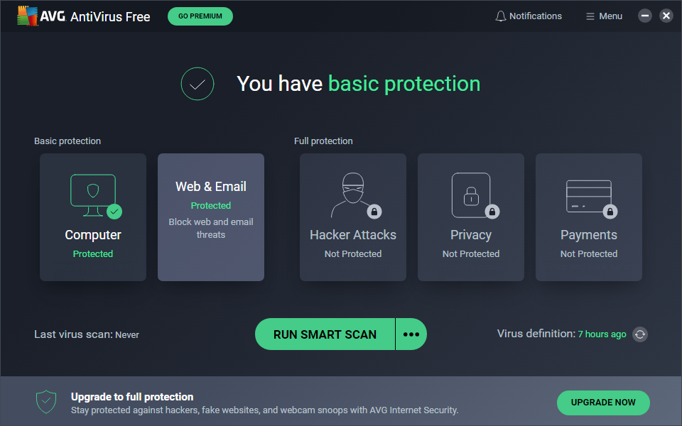
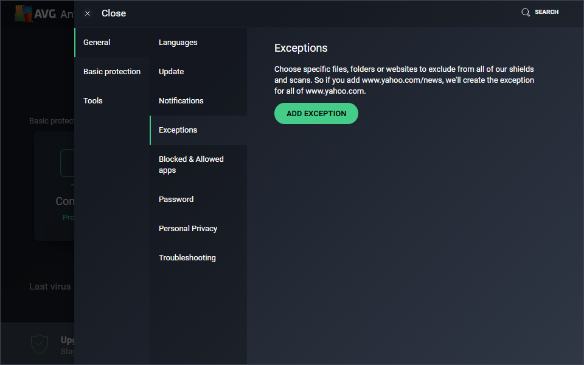
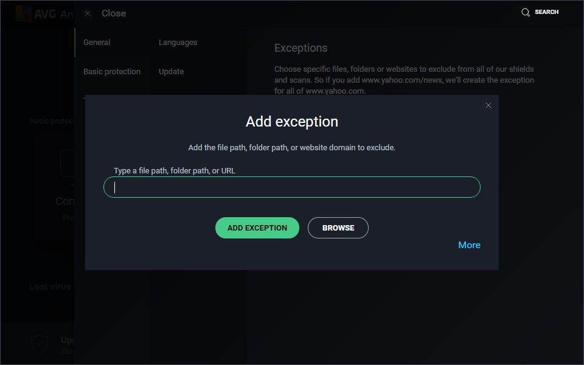
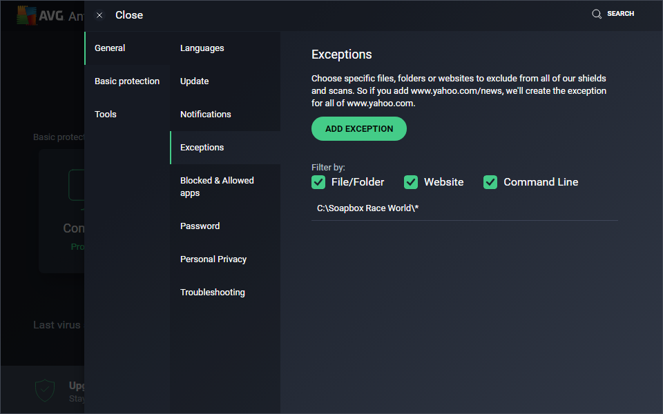
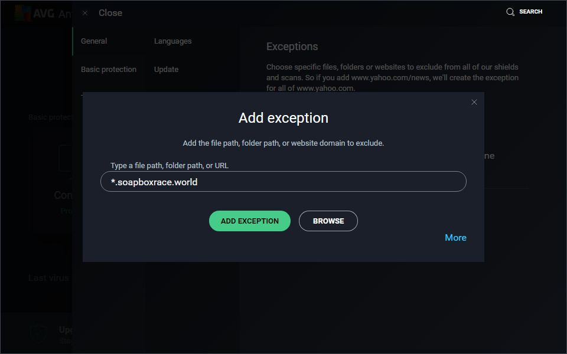
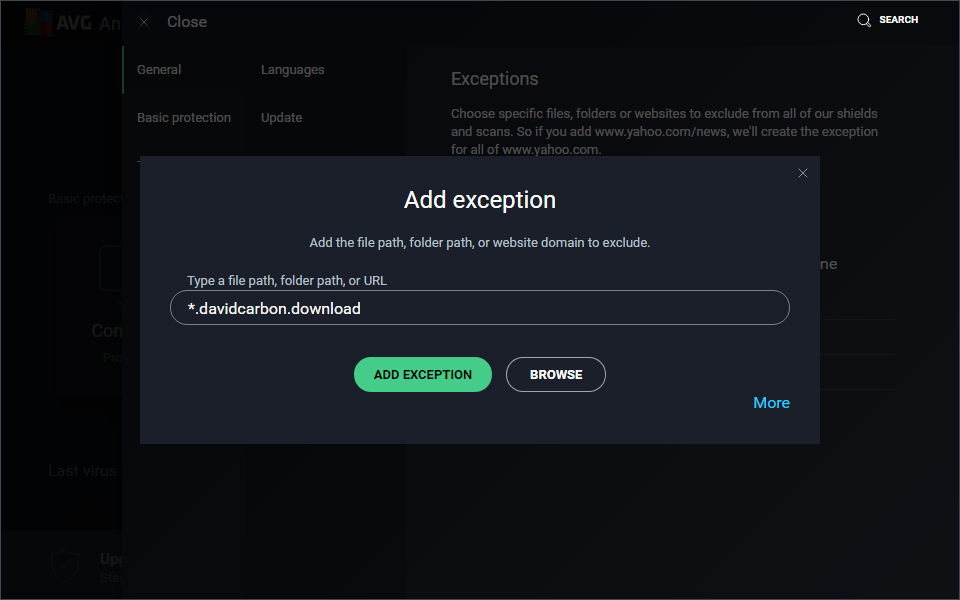
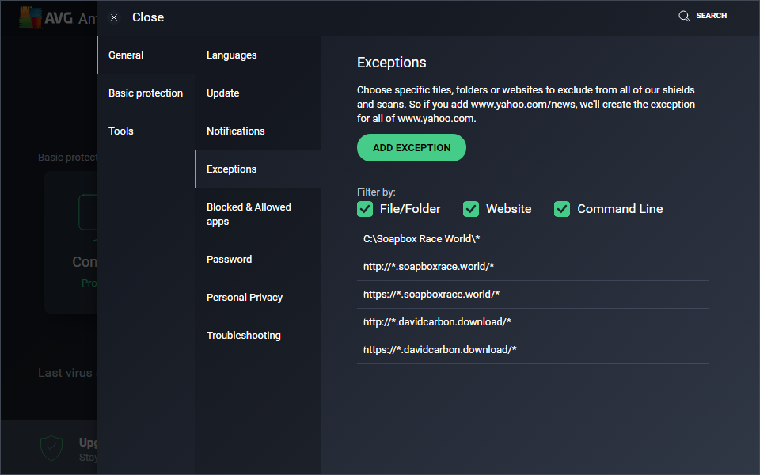
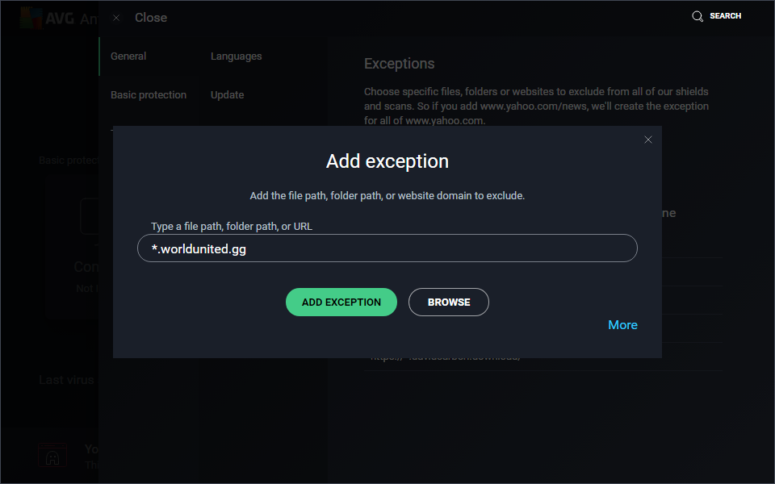
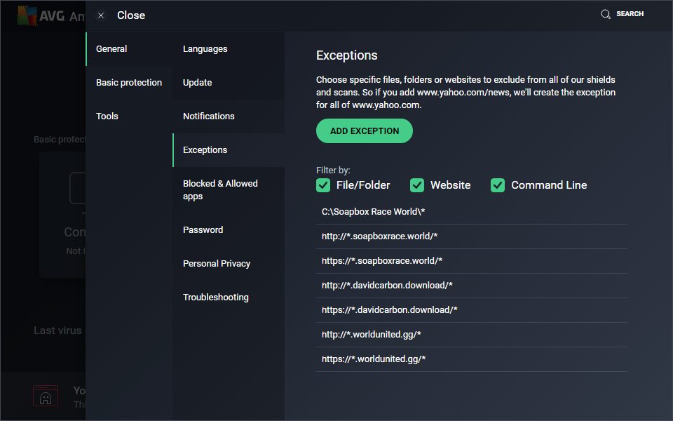

# AVG

Open the AVG Antivirus Panel

Click on the **Menu** Tab to open the Side Menu.

Next Click on the Settings Option.

Open the AVG Antivirus Panel

Open the AVG Antivirus Panel

Open the AVG Antivirus Panel

Open the AVG Antivirus Panel

Open the AVG Antivirus Panel

Open the AVG Antivirus Panel

Open the AVG Antivirus Panel

Open the AVG Antivirus Panel

Open the AVG Antivirus Panel

Open the AVG Antivirus Panel