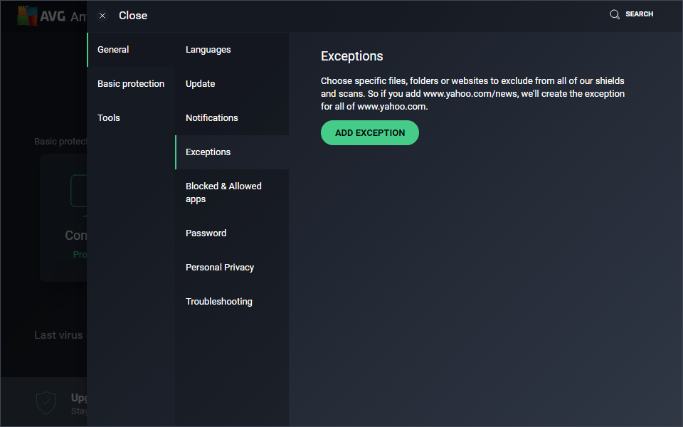
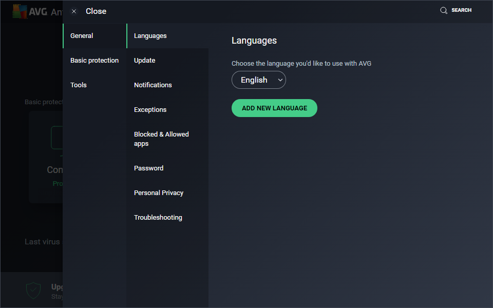
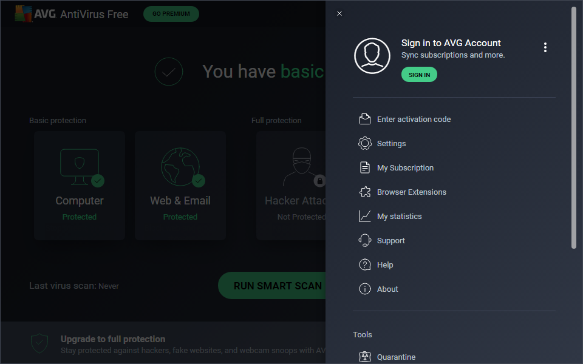

# AVG

.PNG)

Open the AVG Antivirus Panel

.PNG)

Open the AVG Antivirus Panel

.PNG)

Open the AVG Antivirus Panel

.PNG)

Open the AVG Antivirus Panel

Open the AVG Antivirus Panel

Open the AVG Antivirus Panel

Open the AVG Antivirus Panel

.PNG)

Open the AVG Antivirus Panel

Open the AVG Antivirus Panel

.PNG)

Open the AVG Antivirus Panel

.PNG)

Open the AVG Antivirus Panel

.PNG)

Open the AVG Antivirus Panel

.PNG)

Open the AVG Antivirus Panel

.PNG)

Open the AVG Antivirus Panel