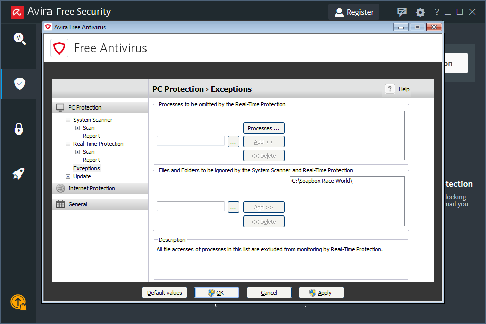

# Avira

Open the Avira Antivirus Panel

Click on the **Menu** Tab to open the Side Menu.

Next Click on the Settings Option.

Open the Avira Antivirus Panel

Open the Avira Antivirus Panel

Open the Avira Antivirus Panel

Open the Avira Antivirus Panel

Open the Avira Antivirus Panel

Open the Avira Antivirus Panel

Open the Avira Antivirus Panel

Open the Avira Antivirus Panel

Open the Avira Antivirus Panel

Open the Avira Antivirus Panel