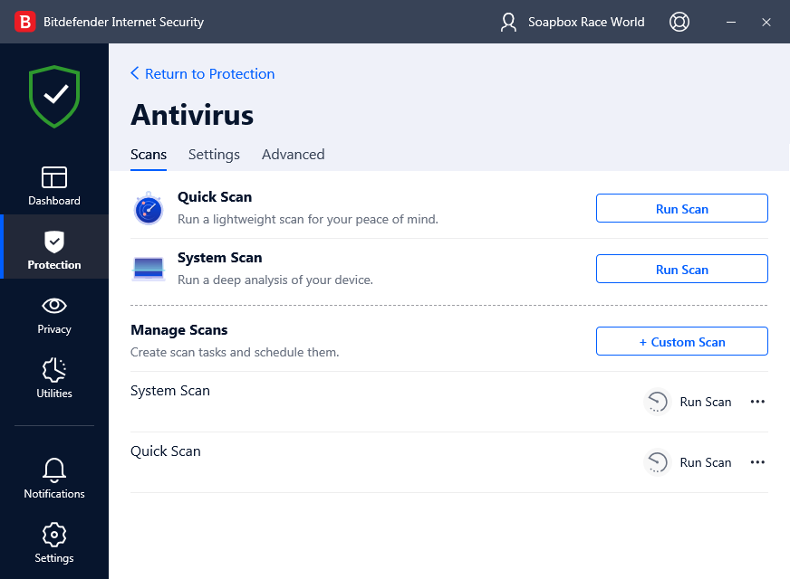

# Bitdefender Internet Security

Open the BIS Antivirus Panel

Click on the **Menu** Tab to open the Side Menu.

Next Click on the Settings Option.

Open the BIS Antivirus Panel

Open the BIS Antivirus Panel

Open the BIS Antivirus Panel

Open the BIS Antivirus Panel

Open the BIS Antivirus Panel

Open the BIS Antivirus Panel

Open the BIS Antivirus Panel

Open the BIS Antivirus Panel

Open the BIS Antivirus Panel

Open the BIS Antivirus Panel