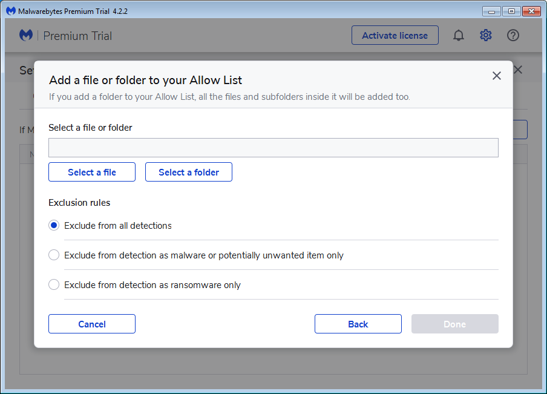
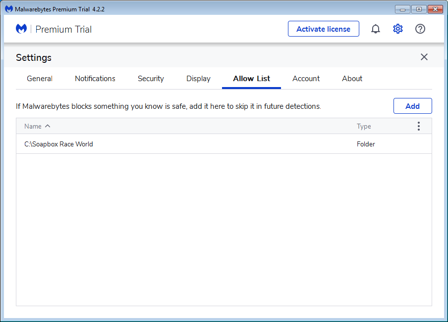

# Malwarebytes

Open the Malwarebytes Antivirus Panel

Click on the **Menu** Tab to open the Side Menu.

Next Click on the Settings Option.

Open the Malwarebytes Antivirus Panel

Open the Malwarebytes Antivirus Panel

Open the Malwarebytes Antivirus Panel

Open the Malwarebytes Antivirus Panel

Open the Malwarebytes Antivirus Panel

Open the Malwarebytes Antivirus Panel

Open the Malwarebytes Antivirus Panel

Open the Malwarebytes Antivirus Panel

Open the Malwarebytes Antivirus Panel

Open the Malwarebytes Antivirus Panel

Open the Malwarebytes Antivirus Panel

Open the Malwarebytes Antivirus Panel

Open the Malwarebytes Antivirus Panel

Open the Malwarebytes Antivirus Panel