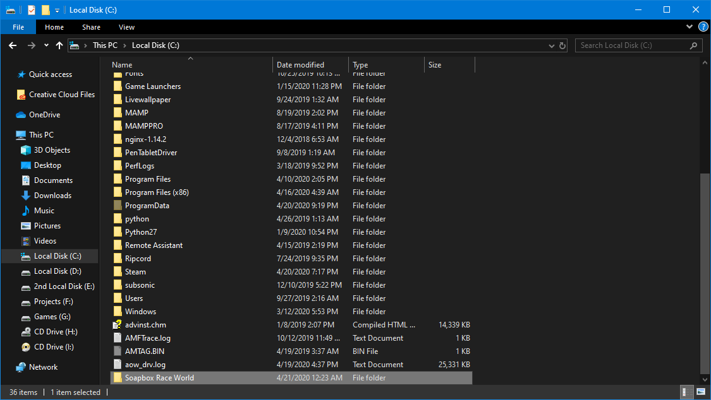
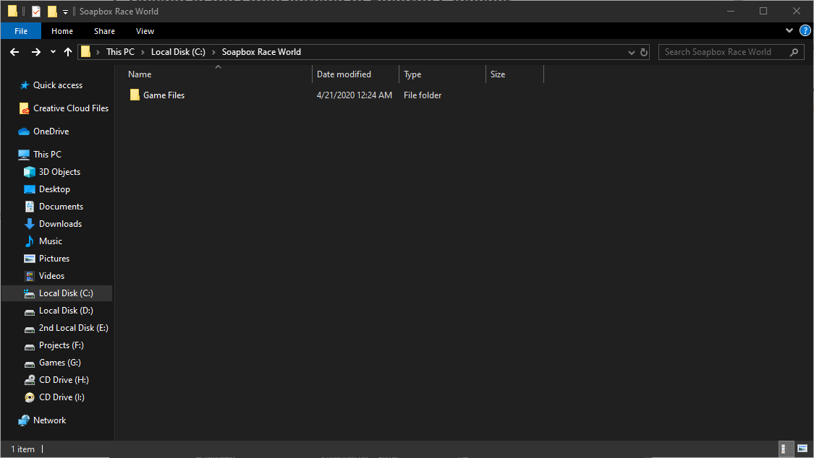
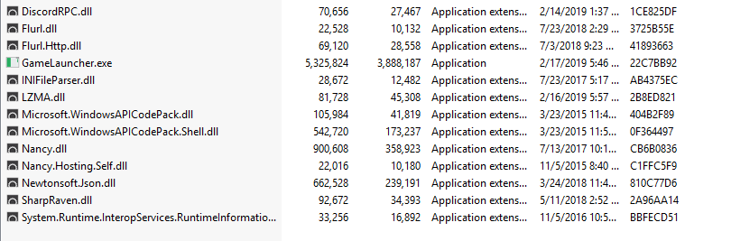

# Electron Launcher

## 1. Download the latest version of Electron Launcher 

💾 [Download Latest Electron Launcher](https://launcher.sparkserver.eu/)

## **2. Creating Game Files and Launcher Folders**

**Create a folder where the Game Files and Game Launcher will be installed**

**a. Create a Folder** _**Soapbox Race World**_

**Create two folders within the Soapbox Race World Folder**

**a. Create a Folder** _**Game Files**_


In this example the Directory is on the C: Drive

_If your doing it on a different Drive make sure to have the directory structure this_


## **3. Extracting the ZIP**

_**Make sure you extract the ZIP in the Launcher folder**_

## **4. Choosing Your Download Type and Source**


Depending on the time and day, a CDN might be bottlenecked due to an increase of traffic
















## **6. Choosing Game File Directory**


C:\Soapbox Race World\Game Files

Note that this might be different depending if you have installed the game launcher on a different Drive


## **7. Race Complete**

