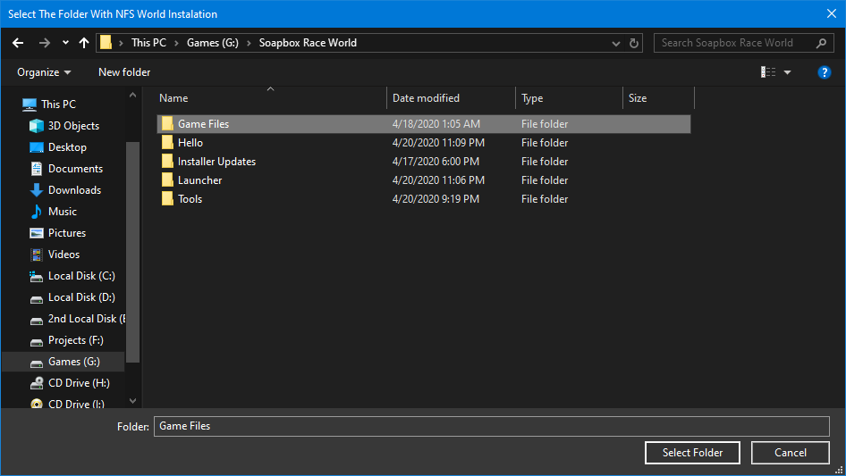
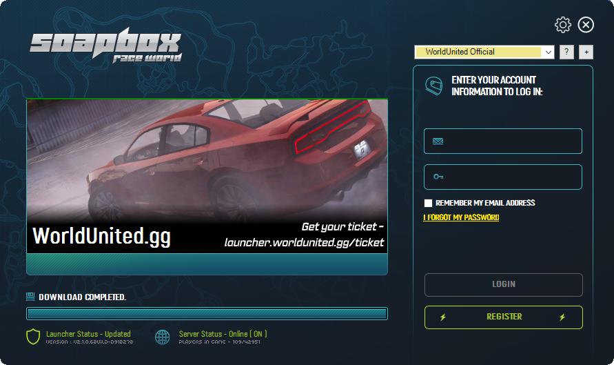

# Installer \(Windows Only\)

### 1. Download the latest version of Game Launcher Installer 

💾 [Download Latest Installer](https://github.com/1DavidCarbon/Soapbox_Launcher_Installer/releases/latest/download/SBRW.Installer.exe)

### **2. Choose Your** Language

### **3. Choose Your Installation Directory**


Default Directory is on your C:\ Drive


### **4. Launch Game Launcher**

### **5. Choosing Your Download Type and Source**


Depending on the time and day, a CDN might be bottlenecked due to an increase of traffic
















### **6. Choosing Game File Directory**


C:\Soapbox Race World\Game Files

Note that this might be different depending if you have installed the game launcher on a different Drive


### **7. Race Complete**

