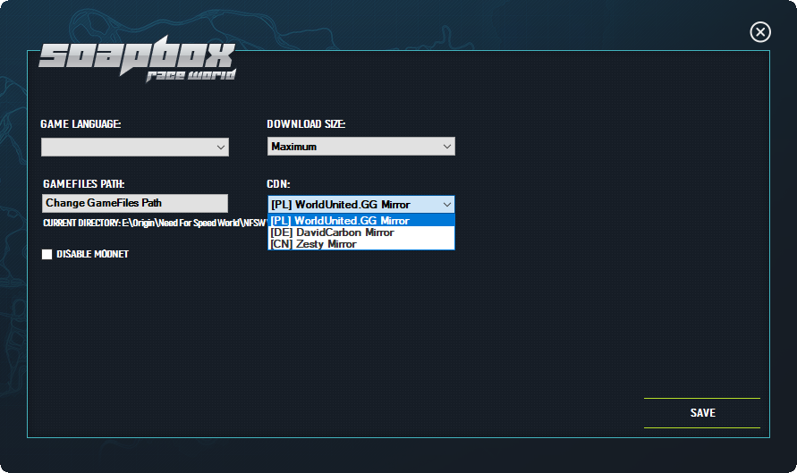
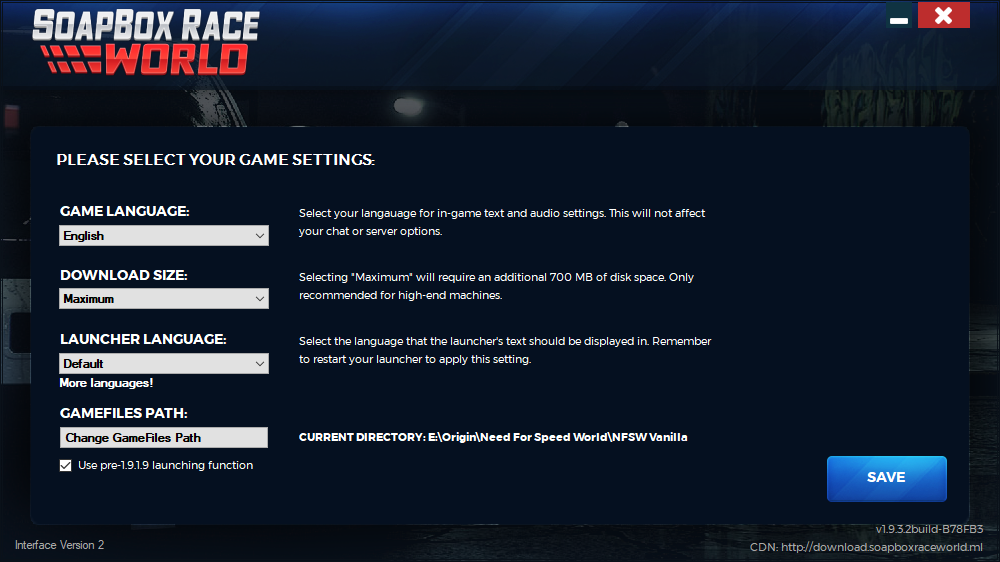
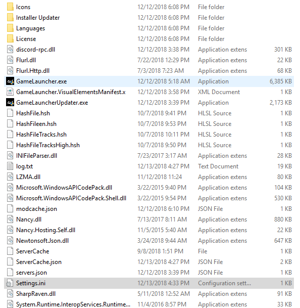

# CDN

## **Documentation for CDN**

**What is a CDN?**

A content delivery network _\(CDN\)_ is a system of distributed servers \(network\) that deliver pages and other Web content to a user, based on the geographic locations of the user, the origin of the webpage and the content delivery server.

**Version 2.0.X.X & Newer \(Interface Version 3\)**

The Game Launcher was recorded to include a CDN server list chooser. The user can access the the settings by clicking on the Gear Icon at the Top Right on the Login Screen.



When clicking on the CDN Selection Drop Down Menu you are able to choose the available CDN's being hosted by community members. This would be important if the user's game files were removed or corrupted the game launcher would re-download the files if necessary.

**Version 1.9.X.X \(Interface Verison 2\)**

This Version of the Game Launcher **does not** Include a CDN list chooser. The only method to change CDN's would be to go into the Game Launcher Folder Directory and changing/adding a line to switch the default CDN.

To get a CDN URL please [Click Here](http://launcher.worldunited.gg/cdn_list.json) to get publicly available CDN's to choose from.





```
[GameLauncher]
CDN = http://cdn.worldunited.gg/nfsw/
TracksHigh = 1
InstallationDirectory = 
Language = 
ModNetDisabled = 
Server = 
AccountEmail = 
Password = 
LauncherPosX = 
LauncherPosY = 
```


**Version 1.0.X.X \(Interface Version 1\)**

It's not possible to change CDNS. It's also not possible to change the default CDN in the Game Launcher Code due to the different method of extracting the game files.


