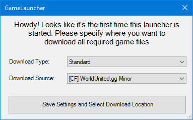
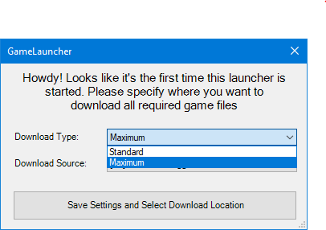
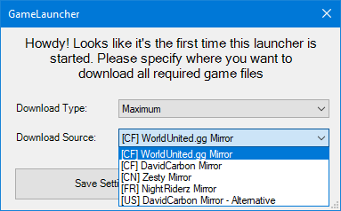

# Installer \(Windows Only\)

### 1. Download the latest version of Game Launcher Installer <a id="1-download-the-latest-version-of-windowsgsm"></a>

💾 [Download Latest Installer](https://github.com/1DavidCarbon/Soapbox_Launcher_Installer/releases/latest/download/SBRW.Installer.exe)

### **2. Choose Your** Language


### **3. Choose Your Installation Directory**


Default Directory is on your C:/ Drive



### **4. Launch Game Launcher**


### **5. Choosing Your Download Type and Source**


Depending on the time and day, a CDN might be bottlenecked due to an increased traffic
















```
$ give me super-powers
```

Once you're strong enough, save the world:


```bash
# Ain't no code for that yet, sorry
echo 'You got to trust me on this, I saved the world'
```



